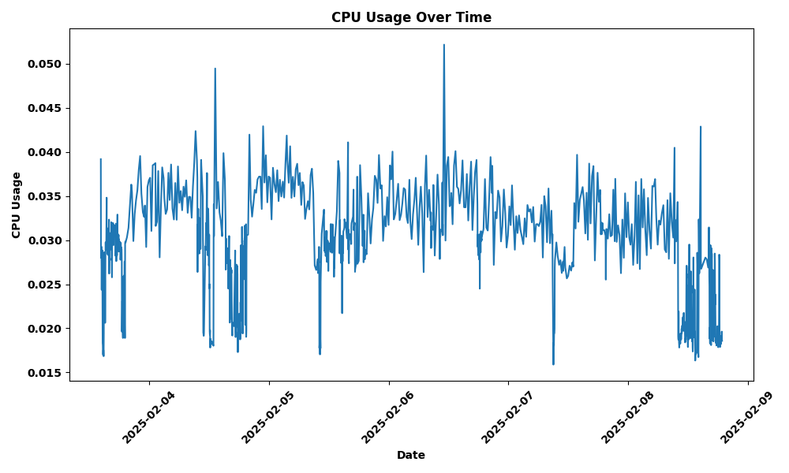

# Emergency Backup Desktop Application


## Table Of Content
<!-- TOC -->
* [Introduction](#introduction)
* [Features](#features)
* [Quick start](#quick-start)
  * [1. Download and start the installer executable](#1-download-and-start-the-installer-executable)
  * [2. Setup and run the mouse_tracker agent](#2-setup-and-run-the-mouse_tracker-agent)
    * [Using embgui](#using-embgui)
    * [Using embctl](#using-embctl)
  * [3. Advanced mode](#3-advanced-mode)
* [CPU Consumption](#cpu-consumption)
* [Uninstall](#uninstall)
* [Documentation](#documentation)
<!-- TOC -->

## Introduction

This project, developed by Giovanni Mirarchi for the System Programming course at the Politecnico di Torino (Master's Degree), implements a cross-platform Rust language application for PC, usable in both Unix and Windows environments, that allows you to perform an emergency backup in case the screen is not usable.

## Features

The application offers the following features:

- **Backup activation via conventional command:** Users can initiate a backup using specific mouse gestures, touching all 4 desktop corners (starting from top-left).
- **Confirmation via a second conventional command:** After the first command, to confirm the user intention, a second mouse gesture is required (the same as before, an U along the screen corners). Finally, a system notification is sent, indicating whether the backup was successful
- **Backup Source Selection:** Users can specify the source of the backup, designating the folder or files types to be included in the backup process.
- **Backup types:** The application supports different types of backups, including:
    - **Full Folder Backup:** Backs up the entire contents of a selected folder. File extension filters can be applied to include or exclude specific file types.
    - **File Type Backup:** Backs up all files with a specific extension.
- **Backup to external drive**: To back up to an external drive (USB flash drive, SSD, ...), users can choose it as the destination in the backup settings and provide its path.

## Quick start

The Emergency Backup project consists of three main executables:

- `embctl`
- `embgui`
- `mouse_tracker`

The first two (`embctl` and `embgui`) are a command-line tool (CTL) and a graphical user interface (GUI) for managing the `mouse_tracker`.

For usage, instructions and technical details refer to the individual README.md files for each executable:

- `embctl` - [embctl/README.md](embctl/README.md)
- `embgui` - [embgui/README.md](embgui/README.md)

The `mouse_tracker` executable is the core of the application. It tracks user mouse movements and triggers the backup upon detecting the designated gesture. See its `README.md` for details:

- `mouse_tracker` - [mouse_tracker/README.md](mouse_tracker/README.md)

A fourth executable, simply named `installer`, has been developed to simplify application distribution.

- `installer` - [installer/README.md](installer/README.md)

### 1. Download and start the installer executable

In order to be ready to start, you should choose the right installer in the **[release](https://github.com/giovannimirarchi420/emergency-backup/releases)** page, the file names use the following format: **\<arch\_type\>**-**\<os\>**.
Once downloaded execute it **with admin privileges** and follow the instructions, you can check further details on installer [README.md](installer/README.md) page.

Now you can choose your favourite tool to set up and run the backup agent in background: **embgui** or **embctl**.
The usage of the embgui heavily simplify the management of the tools, since it provide access to everything you need in a clever way.
On the other hand, embctl provide you the possibility to integrate the backup management with some script automation.

### 2. Setup and run the mouse_tracker agent

#### Using embgui

Executing `embgui` you will be immediately on the following page


Proper configuration is essential for the tool to function correctly. Running the agent without proper settings will result in an error message. For basic use, you only need to specify the backup source and destination (including external hard drives) from the "General" tab in the "Settings" page.

For more advanced customization options, refer to the [embgui documentation page](embgui/README.md).

Once configured, navigate back to the "Home" page and click "Turn On." The large circle will turn green, indicating the agent is now tracking your mouse movements.

To initiate a backup, draw a "U" shape along the display edges, starting from the top-left corner. If successful, a notification will appear confirming the detected command. Press "Cancel" to stop the backup process. Otherwise, repeat the "U" shape starting from the top-left corner to begin the backup.

**Note:** On Windows, due to technical limitations, a pop-up window will not be displayed. Instead, a system notification will indicate mouse command detection. If the confirmation command is executed within the next 'tracking_windows' seconds (configurable via `embgui` or `embctl`), a backup will be created. Otherwise, the mouse tracker will reset and begin listening from the start.

#### Using embctl

**For Windows users:** Refer to the `embctl` documentation for instructions on running the tool from any location on your system.
Alternatively, open a command prompt and navigate to the `embctl` installation folder.

To set the backup source and destination folders, use the following commands:

```bash
# Wrap the path in double quotes (") if it contains spaces.
embctl set-source <backup_source_path>
embctl set-destination <backup_destination_path>
```

Start the mouse tracker agent with:
```bash
embctl start
```
This will continuously track your mouse movements, even after system restarts due to automatic agent relaunch.

To stop tracking, use:
```bash
embctl stop
```
Refer to the [embctl documentation](embctl/README.md) for more details on advanced settings.

### 3. Advanced mode
For advanced users, an alternative way to install the Emergency Backup tool is by building it from source code. Here's how:

1. Download the source code
2. Once downloaded, use your terminal to navigate to the folder containing the project files.

Then, run:
```bash
cargo build --release
```

The compiled executables will be placed in the `/target/release` folder. Run the installer executable to automatically set up everything in the correct locations.

**Note:** The first build attempt might encounter a compilation error due to the `installer` crate referencing executables not yet created in the target folder. Simply re-run `cargo build --release` to resolve this.

**Note for macOS users:** macOS users building the `embgui` executable for their specific architecture might need the `cargo-bundle` utility. Refer to the [embgui/README.md](embgui/README.md) for details on installing `cargo-bundle` and bundling the application for macOS.

## CPU Consumption
This data was collected on a MacBook Air M1 with 16GB of RAM. The graph illustrates the CPU consumption percentage over a five-day period.



Based on the graph, we can conclude that the average CPU consumption falls between 0.02% and 0.04%.

## Uninstall

Right now Emergency Backup does not provide an uninstaller. In order to completely delete all files related to Emergency Backup perform the following steps:

- **Windows**
  - Turn off the mouse tracker (`embctl stop`).
  - Delete folder: `C:\ProgramData\.emergency-backup`
  - Delete folder: `<installation_folder>\EmergencyBackup`
- **macOS/Linux**
  - Turn off the mouse tracker (`embctl stop`).
  - Delete folder: `$HOME/.emergency-backup`
  - Delete folder: `<installation_folder>/EmergencyBackup`
  - Delete `embctl` executable located at: `/usr/local/bin/`

## Documentation

List of README.md Files:

- [config](config/README.md)
- [embctl](embctl/README.md)
- [embgui](embgui/README.md)
- [installer](installer/README.md)
- [mouse_tracker](mouse_tracker/README.md)
- [service-manager-util](service-manager-util/README.md)
- [settings](settings/README.md)
- [window-spawn-util](window-spawn-util/README.md)
