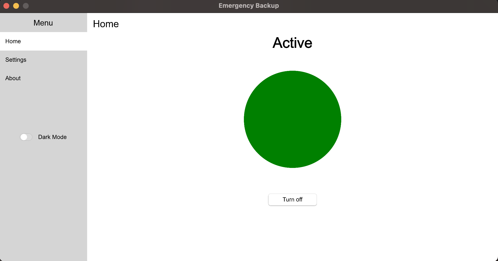
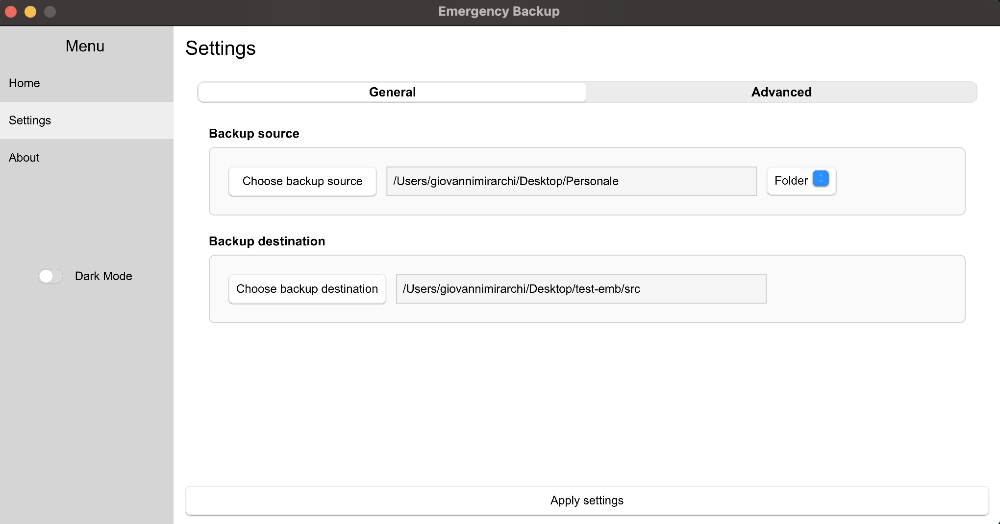
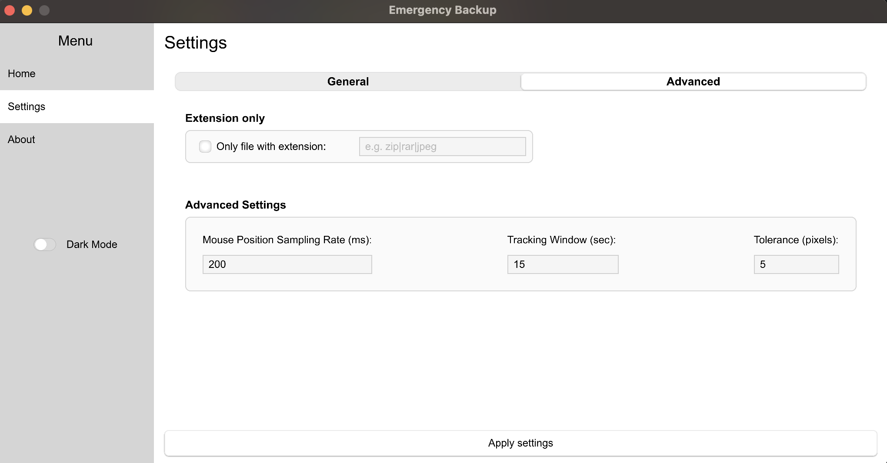
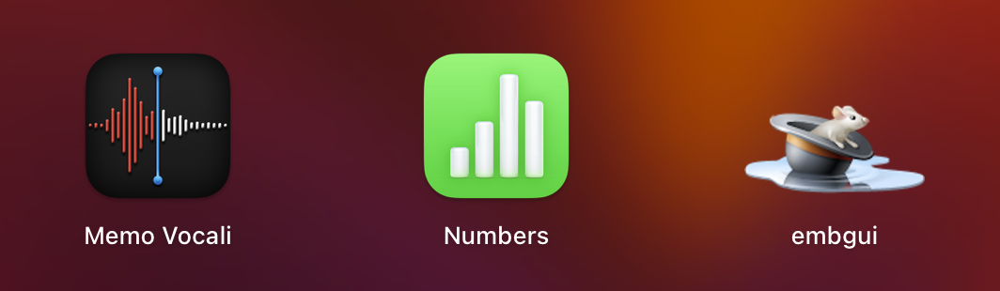

# embgui - Graphical User Interface for Emergency Backup Tool

embgui is a (stand-alone) graphical user interface (GUI) for the emergency backup tool (thus, the embctl tool is not required). It provides the same functionalities as embctl but with an intuitive and easy-to-use interface, allowing you to configure and manage emergency backups more efficiently.

Features:

- **Start**, **stop**, and **check the status** of the emergency backup daemon process
- View current **configuration**
- Set all the following configurations:
  - **Mouse position Sampling Frequency**, lower is the value of this parameter, more accurate the mouse tracking will be but with an higher CPU consumption as drawback.
  - **Tracking Window (sec)** this value specify the number of seconds that the mouse command must be started and finished.
  - **Tolerance (pixels)** Tolerance for touching in the corners of the display. The maximum display size may not be perfectly "clickable", so this tolerance allows the user to activate the backup action even if the position is not perfectly precise.
  - **Extension-based backup** If active the agent will backup only files with specified extensions.
  - **Backup Target File Extensions** The list of extension for the previous flag.
  - **File or Folder Backup mode** If the target of the backup is a single file or an entire directory (eventually filtered with the file extension mode).

## A GUI built on top of the Slint Framework

This GUI has been written leveraging the [Slint framework](https://slint.dev/). This framework provides a language-agnostic front-end language that is compiled into native code for the target platform (desktop, mobile, web, or embedded system). This approach offers several advantages:

- **Native Performance**: Slint applications achieve native performance by being compiled directly to machine code, resulting in a smooth and responsive user experience.
- **Rich User Interface**: Slint allows for the creation of rich and visually appealing user interfaces with various controls and components.
- **Cross-Platform Compatibility**: With different back-ends for code generation, Slint enables you to develop a single codebase that can be deployed on various platforms.

I chose Slint for embgui's development due to these benefits, allowing me to deliver a user-friendly and efficient graphical interface for emergency backup management.

## GUI Screenshots:







## Benefits of embgui:

- Intuitive and easy-to-use interface
- Simpler emergency backup configuration and management
- Clear display of backup settings

## How to Install embgui:

### Easy mode (suggested)

An installer is provided for each operating system and architecture. This installer allows you to choose whether to install the CLI application, the GUI application, or both, in a folder you select. 
Check it out on the [installer README.md](../installer/README.md).

### Advanced mode - for expert users

- Download the latest version of `embgui` source code from the GitHub repository.
- Compile it running `cargo build --release`
- Do the same for the `mouse_tracker` crate, then you've to put it in a directory and set the absolute path of the folder containing this executable in the app `config.yaml` file:
  - On Windows: Run `embgui`, in this way the config folder will be created, then go in `C:\ProgramData\.emergency-backup` and set in `config.yaml` the right `installation_dir` option.
  - On Unix Systems: Run `embgui`, in this way the config folder will be created, then go in user home directory (`$HOME/.emergency-backup`) and set in `config.yaml` the right `installation_dir` option.
- Run the output executable in `/target/release/embgui`

The `mouse_tracker` crate is the daemon service that will be installed on the system through system service manager (sc.exe, launchd or systemd) .

#### Bundle it as OS Application (MacOS specific)

- Using the [cargo-bundle](https://github.com/burtonageo/cargo-bundle) utility, is possible to bundle the embgui in an OS application, in order to be used as a normal application on your macOS system.
- Once you downloaded the source code, change directory in embgui root folder, than execute:
```bash
cargo bundle --target <your_target> --bin embgui
``` 
e.g. for macOS on ARM architecture:
```bash
cargo bundle --target aarch64-apple-darwin --bin embgui --release
``` 

This command will create the output folder `target/<your_target>/release/bundle/osx/embgui.app`

The `embgui.app` is a folder, but once it is moved in your fs (e.g. under Applications/) it will be shown as a normal application.



## How to Use embgui:

- Launch embgui.
- In the main window, you can view and modify backup settings.
- Use the buttons to start, stop, or check the status of the emergency backup daemon process.

