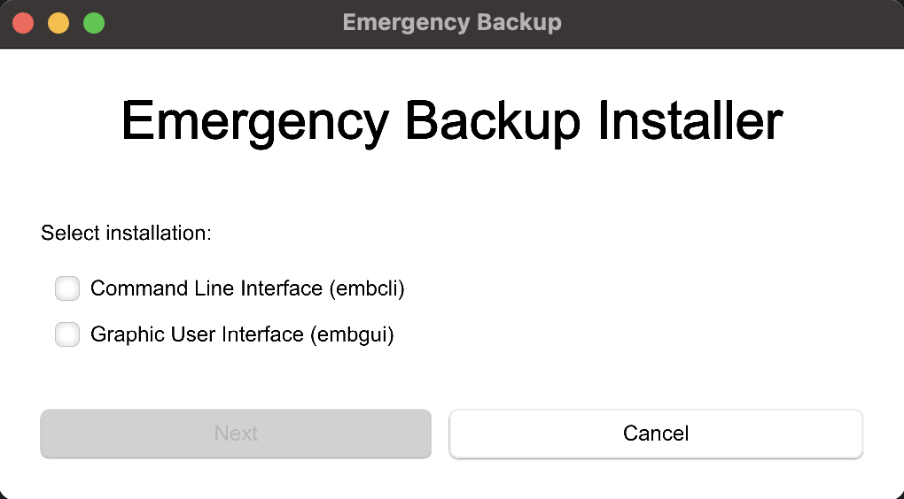
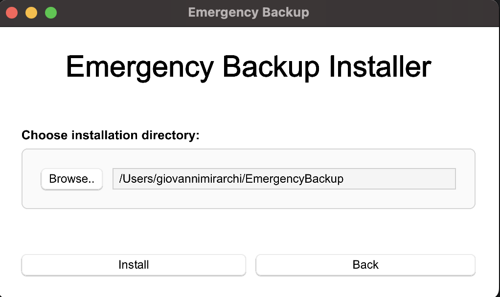

# Installer for Emergency Backup Tool

This crate provides an installer for the embcli, embgui, and mouse_tracker applications, which together form a comprehensive emergency backup solution. The installer simplifies the distribution and installation of these applications by bundling them into a single executable.

**Key Features:**

- **Simplified Installation**: Installs `embcli`, `embgui`, and `mouse_tracker` with a single click.
- **Platform Support**: Provides installers for various operating systems and architectures.
- **Installation Customization**: Allows users to select which applications (`embcli` and/or `embgui`) to install and choose the installation directory.

## Screenshots

## Installation Instructions:

- Download the appropriate installer for your operating system and architecture from the **[release](https://github.com/ProgrammazioneDiSistema2024-IA-ZZ/Group12/releases)** page.
- Run the downloaded installer executable.
  - For Unix users: run the installer as administrator, this because the `embcli` executable will be placed in the `/usr/local/bin` folder to access it everywhere from your fs.
- Follow the on-screen instructions to select the installation components and directory.
- Once the installation is complete, you can launch `embcli` from your terminal or `embgui` from your desktop environment.
  
